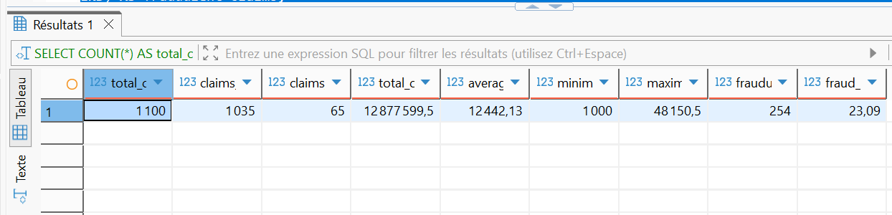
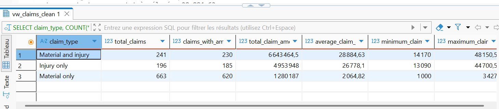
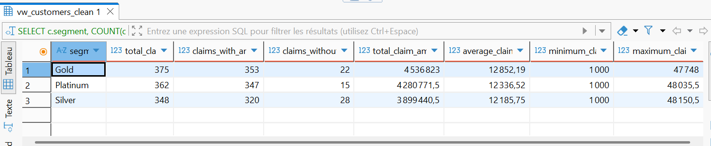
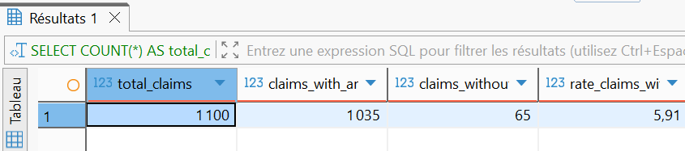
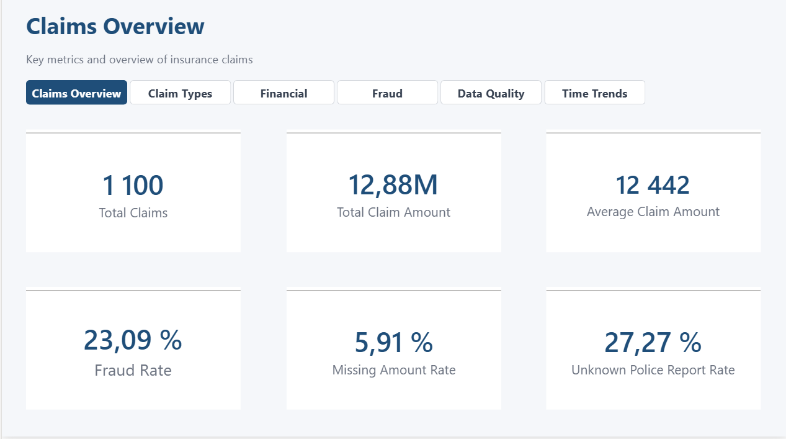
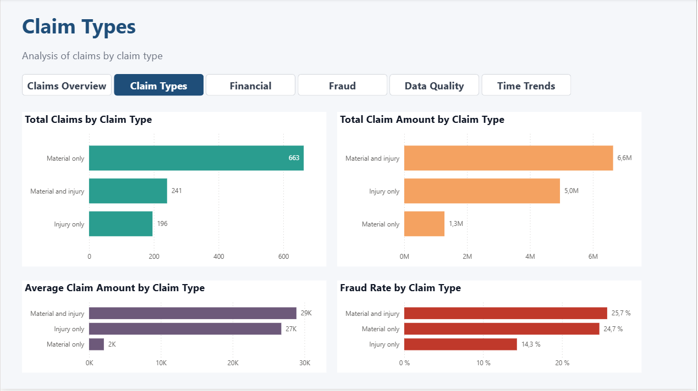
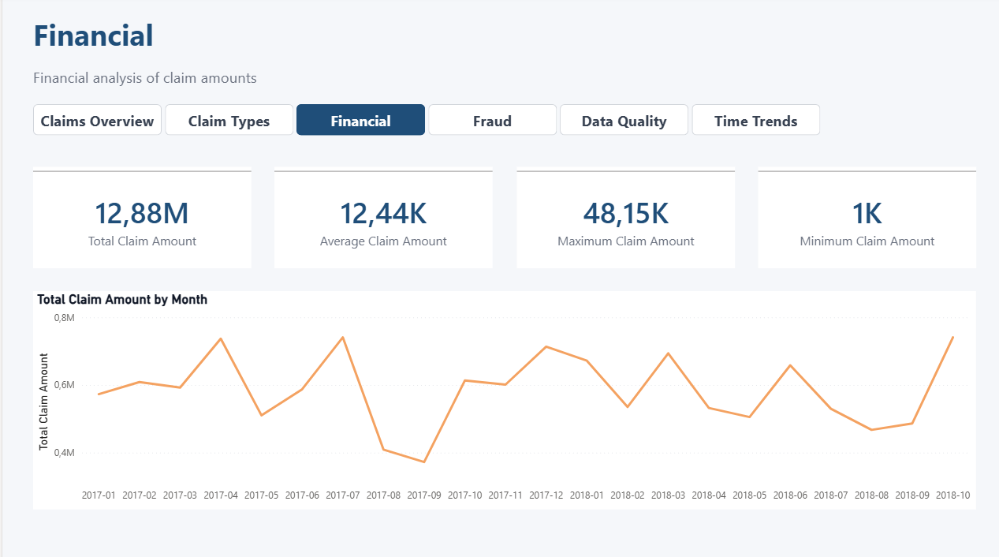
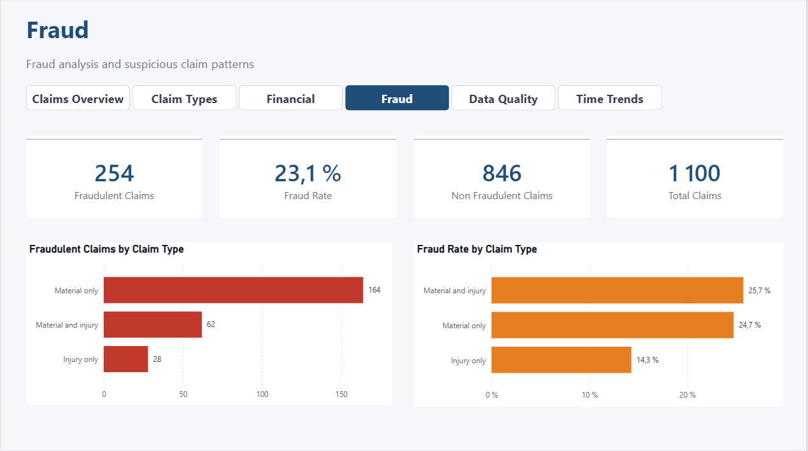
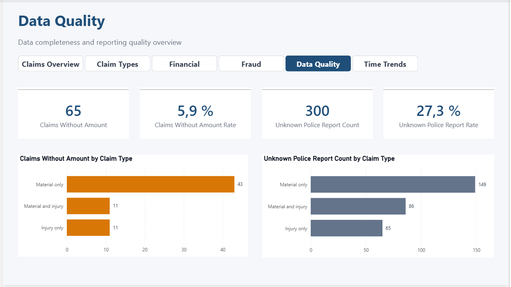
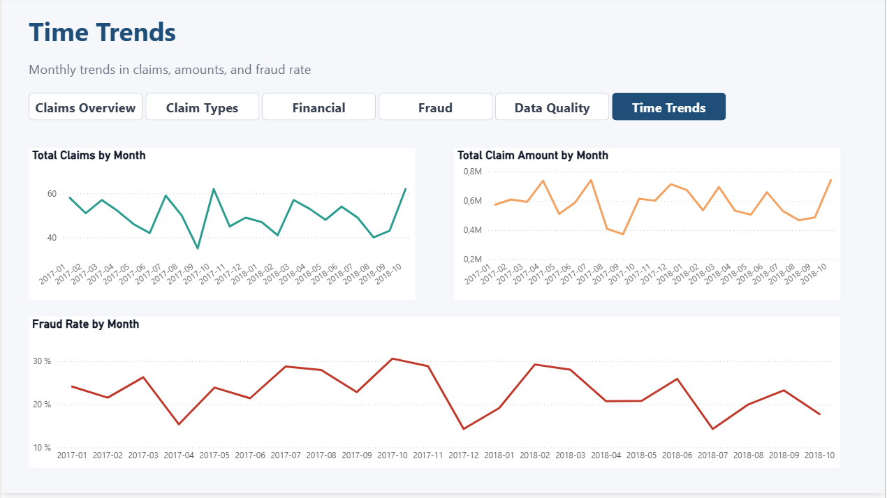

# Analyse de sinistres d’assurance avec SQL & Power BI

## Présentation du projet

Ce projet analyse un portefeuille de sinistres d’assurance à l’aide de SQL et Power BI.

L’objectif est de transformer des données brutes en données propres, fiables et exploitables afin de produire des indicateurs métier clairs. Le projet couvre l’exploration des données, le nettoyage, la création de vues SQL propres, l’analyse des KPI, l’analyse métier et la construction d’un dashboard Power BI.

L’analyse porte principalement sur :

- le volume de sinistres ;
- les montants des sinistres ;
- les types de sinistres ;
- les indicateurs de fraude ;
- les profils clients ;
- les problèmes de qualité des données ;
- les tendances mensuelles.

Le dashboard Power BI final permet de visualiser rapidement les principaux indicateurs du portefeuille : volume, coûts, fraude, qualité des données et évolution dans le temps.

---

## Objectif métier

L’objectif métier principal est d’aider un assureur à mieux comprendre son portefeuille de sinistres.

Le projet répond notamment aux questions suivantes :

- Combien de sinistres sont présents dans le portefeuille ?
- Quel est le montant total et moyen des sinistres ?
- Quels types de sinistres génèrent le plus de coûts ?
- Quels types de sinistres sont les plus associés à la fraude ?
- La fraude est-elle fréquente dans le portefeuille ?
- Existe-t-il des données manquantes ou peu fiables ?
- Comment évoluent le volume de sinistres, les montants et le taux de fraude dans le temps ?
- L’historique disponible est-il suffisant pour réaliser une prévision fiable ?

---

## Outils utilisés

- PostgreSQL
- DBeaver
- Power BI Desktop
- SQL
- DAX
- GitHub

---

## Données utilisées

Le projet repose sur deux jeux de données liés au domaine de l’assurance :

- `claims` : informations sur les sinistres ;
- `customers` : informations sur les clients.

Les données brutes sont stockées dans :

```text
data/raw/
```

Les données nettoyées et exportées depuis SQL sont stockées dans :

```text
data/processed/
```

Les fichiers nettoyés utilisés dans Power BI sont :

```text
claims_clean.csv
customers_clean.csv
```

---

## Structure du projet

```text
insurance-claims-sql-powerbi-analysis/
│
├── README.md
│
├── data/
│   ├── raw/
│   │   ├── claims.csv
│   │   └── cust_demographics.csv
│   │
│   └── processed/
│       ├── claims_clean.csv
│       └── customers_clean.csv
│
├── sql/
│   ├── 01_data_exploration.sql
│   ├── 02_data_cleaning_preparation.sql
│   ├── 03_kpi_analysis.sql
│   └── 04_business_insights.sql
│
├── powerbi/
│   └── insurance_claims_dashboard.pbix
│
└── screenshots/
    ├── sql/
    │   ├── 01_portfolio_overview.png
    │   ├── 02_cost_by_claim_type.png
    │   ├── 03_fraud_overview.png
    │   ├── 04_fraud_by_claim_type.png
    │   ├── 05_cost_by_customer_segment.png
    │   ├── 06_most_expensive_months.png
    │   ├── 07_data_quality_missing_amount.png
    │   └── 08_police_report_distribution.png
    │
    └── powerbi/
        ├── 01_claim_overview.png
        ├── 02_claim_types.png
        ├── 03_financial.png
        ├── 04_fraud.png
        ├── 05_data_quality.png
        └── 06_time_trends.png
```

---

## Démarche du projet

Le projet suit une démarche complète de Data Analyst :

1. Exploration des données avec SQL
2. Nettoyage et préparation des données
3. Création de vues SQL propres
4. Calcul des KPI principaux
5. Analyse métier
6. Export des données nettoyées au format CSV
7. Modélisation des données dans Power BI
8. Création de mesures DAX
9. Construction d’un dashboard Power BI multi-pages
10. Synthèse des résultats et limites de l’analyse

---

## Analyse SQL

### 01_data_exploration.sql

Ce fichier contient l’exploration initiale des données brutes.

Il comprend notamment :

- le volume de lignes ;
- l’inspection des colonnes ;
- l’affichage des premières lignes ;
- l’analyse des valeurs manquantes ;
- la recherche de doublons ;
- l’analyse des valeurs uniques ;
- la vérification des formats de dates ;
- la vérification de la cohérence des données ;
- la vérification des relations entre les sinistres et les clients.

---

### 02_data_cleaning_preparation.sql

Ce fichier contient le nettoyage et la préparation des données.

Il comprend notamment :

- la standardisation de certaines valeurs ;
- la transformation des montants non exploitables en `NULL` ;
- la transformation des dates ;
- le nettoyage des données clients et sinistres ;
- la création de vues SQL propres ;
- la préparation de `vw_claims_clean` et `vw_customers_clean`.

---

### 03_kpi_analysis.sql

Ce fichier contient le calcul des principaux KPI.

Il comprend notamment :

- le nombre total de sinistres ;
- le nombre de sinistres avec montant exploitable ;
- le nombre de sinistres sans montant exploitable ;
- le montant total des sinistres ;
- le montant moyen, minimum et maximum des sinistres ;
- le nombre de sinistres frauduleux ;
- le taux global de fraude ;
- les KPI par type de sinistre ;
- les premiers indicateurs de qualité des données.

---

### 04_business_insights.sql

Ce fichier contient l’analyse métier complète.

Il comprend notamment :

- la vue d’ensemble du portefeuille ;
- l’analyse des coûts ;
- l’analyse de la fraude ;
- l’analyse des profils clients ;
- l’analyse temporelle ;
- l’analyse de la qualité des données ;
- les recommandations métier finales.

---

## Captures SQL

### Vue d’ensemble du portefeuille



### Coût par type de sinistre



### Vue d’ensemble de la fraude


### Fraude par type de sinistre


### Coût par segment client



### Mois les plus coûteux


### Qualité des données : montants manquants



### Distribution des rapports de police


---

## Dashboard Power BI

Le dashboard Power BI a été construit à partir des données nettoyées exportées depuis SQL.

Le rapport contient six pages :

1. Claims Overview
2. Claim Types
3. Financial
4. Fraud
5. Data Quality
6. Time Trends

Le dashboard inclut :

- des cartes KPI ;
- des graphiques en barres ;
- des graphiques en lignes ;
- une navigation entre les pages ;
- des tooltips enrichis avec des mesures de time intelligence.

---

## Pages Power BI

### 1. Claims Overview

Cette page fournit une vue d’ensemble du portefeuille de sinistres.

Elle présente :

- le nombre total de sinistres ;
- le montant total des sinistres ;
- le montant moyen des sinistres ;
- le taux de fraude ;
- le taux de sinistres sans montant renseigné ;
- le taux de rapports de police inconnus.



---

### 2. Claim Types

Cette page analyse les sinistres par type de sinistre.

Elle présente :

- le nombre de sinistres par type ;
- le montant total des sinistres par type ;
- le montant moyen des sinistres par type ;
- le taux de fraude par type de sinistre.



---

### 3. Financial

Cette page se concentre sur l’exposition financière du portefeuille.

Elle présente :

- le montant total des sinistres ;
- le montant moyen des sinistres ;
- le montant maximum d’un sinistre ;
- le montant minimum d’un sinistre ;
- l’évolution mensuelle du montant total des sinistres.



---

### 4. Fraud

Cette page se concentre sur les indicateurs de fraude et les sinistres suspects.

Elle présente :

- le nombre de sinistres frauduleux ;
- le taux de fraude ;
- le nombre de sinistres non frauduleux ;
- le nombre total de sinistres ;
- les sinistres frauduleux par type de sinistre ;
- le taux de fraude par type de sinistre.



---

### 5. Data Quality

Cette page met en évidence les principaux problèmes de qualité des données.

Elle présente :

- le nombre de sinistres sans montant renseigné ;
- le taux de sinistres sans montant renseigné ;
- le nombre de rapports de police inconnus ;
- le taux de rapports de police inconnus ;
- les montants manquants par type de sinistre ;
- les rapports de police inconnus par type de sinistre.



---

### 6. Time Trends

Cette page analyse les tendances mensuelles.

Elle présente :

- le nombre total de sinistres par mois ;
- le montant total des sinistres par mois ;
- le taux de fraude par mois.

Des mesures de time intelligence ont été ajoutées dans les tooltips afin de comparer chaque mois avec le mois précédent.



---

## Principales mesures DAX

Le rapport Power BI contient plusieurs mesures DAX regroupées par type d’analyse.

### Mesures de volume

- Total Claims
- Claims With Amount
- Claims Without Amount
- Claims Without Amount Rate

### Mesures financières

- Total Claim Amount
- Average Claim Amount
- Minimum Claim Amount
- Maximum Claim Amount

### Mesures de fraude

- Fraudulent Claims
- Non Fraudulent Claims
- Fraud Rate

### Mesures de qualité des données

- Unknown Police Report Count
- Unknown Police Report Rate
- Claims Without Customer
- Claims Without Customer Rate

### Mesures de time intelligence

- Total Claims Previous Month
- Total Claims Variation
- Total Claims Variation Rate
- Total Claim Amount Previous Month
- Claim Amount Variation
- Claim Amount Variation Rate
- Fraud Rate Previous Month
- Fraud Rate Variation Points
- Fraud Rate Variation Relative

Ces mesures permettent au dashboard de présenter non seulement des KPI statiques, mais aussi des évolutions mensuelles et des variations par rapport au mois précédent.

---

## Principaux résultats

### Vue d’ensemble du portefeuille

Le portefeuille contient **1 100 sinistres**.

Parmi eux :

- **1 035 sinistres** ont un montant exploitable ;
- **65 sinistres** n’ont pas de montant exploitable ;
- le taux de sinistres sans montant exploitable est de **5,91 %**.

---

### Résultats financiers

Le montant total des sinistres atteint **12,88M**.

Le montant moyen d’un sinistre est de **12,44K**.

Le montant maximum d’un sinistre est de **48,15K**.

Le montant minimum d’un sinistre est de **1K**.

---

### Résultats liés à la fraude

Le portefeuille contient **254 sinistres frauduleux**.

Le taux global de fraude est de **23,09 %**, ce qui signifie que près d’un sinistre sur quatre est identifié comme frauduleux.

Les sinistres frauduleux sont moins nombreux que les sinistres non frauduleux, mais ils représentent un indicateur de risque important pour l’assureur.

---

### Résultats par type de sinistre

Les sinistres `Material only` représentent le volume le plus important.

Cependant, les sinistres `Material and injury` génèrent le montant total le plus élevé ainsi que le taux de fraude le plus important.

Cela montre que les sinistres impliquant des blessures ont un impact financier beaucoup plus élevé.

---

### Résultats sur la qualité des données

Les données sont exploitables pour l’analyse, mais certaines limites doivent être prises en compte.

Les principaux problèmes de qualité des données sont :

- **65 sinistres** sans montant exploitable ;
- **300 sinistres** avec un statut de rapport de police inconnu ;
- un taux de rapports de police inconnus de **27,27 %**.

La colonne `police_report` doit donc être interprétée avec prudence.

---

### Résultats temporels

Les tendances mensuelles montrent des variations du volume de sinistres, du montant total des sinistres et du taux de fraude.

Certains mois présentent une exposition financière plus élevée ou un taux de fraude plus important, ce qui peut aider à identifier des périodes nécessitant une surveillance renforcée.

---

## Recommandations métier

À partir de l’analyse, plusieurs recommandations peuvent être formulées :

1. Surveiller en priorité les sinistres impliquant des blessures, car ils génèrent l’exposition financière la plus élevée.
2. Approfondir l’analyse de la fraude, notamment pour les types de sinistres présentant les taux de fraude les plus élevés.
3. Améliorer la qualité des données, en particulier sur les montants manquants et les rapports de police inconnus.
4. Suivre les tendances mensuelles afin d’identifier les périodes avec des coûts ou taux de fraude anormalement élevés.
5. Utiliser le dashboard comme outil de suivi du volume de sinistres, de l’exposition financière, de la fraude et de la qualité des données.

---

## Limites de l’analyse

Ce dashboard est centré sur une analyse descriptive et diagnostique.

Aucune prévision n’a été intégrée, car l’historique disponible est limité. Un modèle de prédiction fiable nécessiterait une approche dédiée de validation temporelle.

Le jeu de données couvre une période historique limitée, ce qui réduit la fiabilité d’une prévision long terme ou d’un modèle prédictif.

La colonne `police_report` contient également un nombre important de valeurs `Unknown`. Les analyses basées sur cette colonne doivent donc être interprétées avec prudence.

---

## Comment ouvrir le projet

### Analyse SQL

1. Ouvrir PostgreSQL et DBeaver.
2. Importer les fichiers CSV bruts depuis :

```text
data/raw/
```

3. Exécuter les scripts SQL dans l’ordre suivant :

```text
sql/01_data_exploration.sql
sql/02_data_cleaning_preparation.sql
sql/03_kpi_analysis.sql
sql/04_business_insights.sql
```

4. Utiliser les vues nettoyées pour exporter les fichiers traités dans :

```text
data/processed/
```

---

### Dashboard Power BI

1. Ouvrir Power BI Desktop.
2. Ouvrir le fichier :

```text
powerbi/insurance_claims_dashboard.pbix
```

3. Si Power BI demande de reconnecter les sources de données, relier les fichiers à :

```text
data/processed/claims_clean.csv
data/processed/customers_clean.csv
```

4. Actualiser le rapport.

---

## Compétences mobilisées

### SQL

- Exploration des données
- Nettoyage des données
- Préparation des données
- Création de vues SQL
- Agrégations
- Jointures
- `CASE WHEN`
- Transformations de dates
- Fonctions analytiques avec `LAG()`
- Analyse de KPI
- Analyse métier
- Analyse de qualité des données

### Power BI

- Modélisation des données
- Gestion des relations
- Création d’une table calendrier
- Mesures DAX
- Cartes KPI
- Graphiques en barres
- Graphiques en lignes
- Navigation entre les pages
- Design de dashboard
- Tooltips avec mesures de time intelligence
- Mise en forme et homogénéité du rapport

### Analyse de données

- Définition de KPI métier
- Analyse de la fraude
- Analyse financière
- Analyse par type de sinistre
- Évaluation de la qualité des données
- Analyse temporelle
- Reporting de portefeuille

---

## Conclusion

Ce projet montre comment SQL et Power BI peuvent être utilisés ensemble pour transformer des données brutes d’assurance en insights métier exploitables.

SQL a été utilisé pour explorer, nettoyer, préparer et analyser les données.

Power BI a été utilisé pour construire un dashboard clair et interactif centré sur le volume de sinistres, l’exposition financière, les indicateurs de fraude, la qualité des données et les tendances mensuelles.

Le projet met en évidence les principaux moteurs de coût, les comportements liés à la fraude, les limites de qualité des données et les risques métier du portefeuille de sinistres.

Il constitue un projet complet de portfolio Data Analyst combinant SQL, Power BI, DAX, nettoyage de données, analyse de KPI et storytelling métier.
