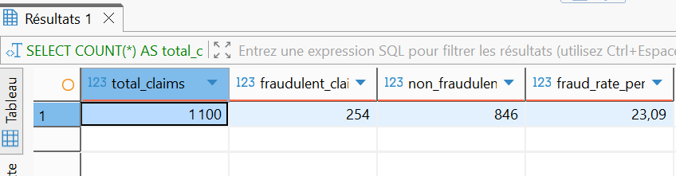
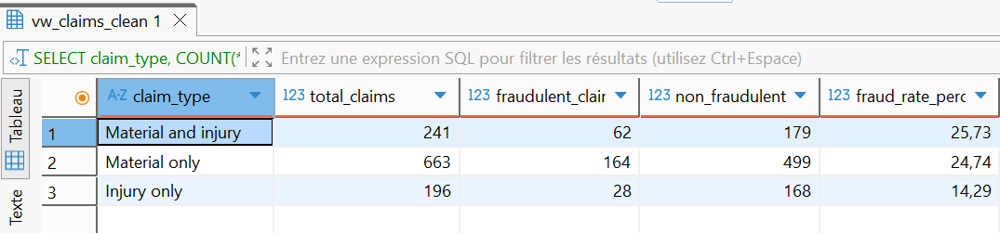
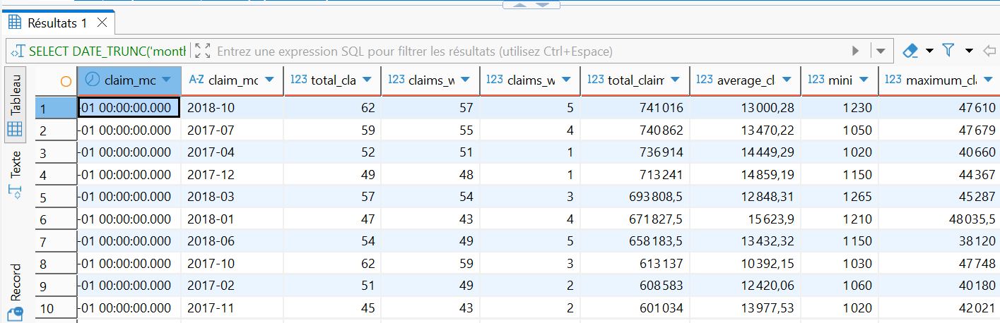
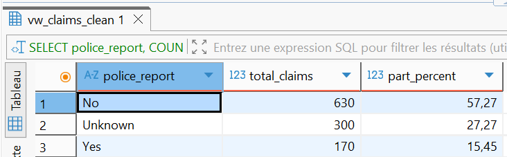

# Insurance Claims SQL Analysis

## 1. Contexte du projet

Ce projet SQL porte sur l’analyse d’un portefeuille de sinistres d’assurance.

L’objectif est de transformer des données brutes en indicateurs métier exploitables afin de mieux comprendre :

- le volume global de sinistres ;
- les coûts associés aux sinistres ;
- les types de sinistres les plus coûteux ;
- les profils clients les plus exposés ;
- les comportements liés à la fraude ;
- les périodes les plus risquées ;
- les limites de qualité des données.

Ce projet a été réalisé avec PostgreSQL et DBeaver.

---

## 2. Objectif métier

L’objectif métier principal est d’aider un assureur à mieux comprendre son portefeuille de sinistres.

Les questions principales sont :

- Combien de sinistres sont présents dans le portefeuille ?
- Quel est le coût total et moyen des sinistres ?
- Quels types de sinistres génèrent le plus de coût ?
- La fraude est-elle fréquente ?
- Les sinistres frauduleux coûtent-ils plus cher ?
- Certains profils clients sont-ils plus associés à la fraude ou au coût ?
- Existe-t-il des périodes où le risque est plus élevé ?
- Les données sont-elles suffisamment fiables pour réaliser l’analyse ?

---

## 3. Données utilisées

Le projet repose sur deux tables liées au domaine de l’assurance :

- `claims` : informations sur les sinistres ;
- `customers` : informations sur les clients.

Les données brutes sont stockées dans le dossier `data/raw/`.

Des vues nettoyées ont ensuite été créées et utilisées pour l’analyse :

- `vw_claims_clean` ;
- `vw_customers_clean`.

Ces vues permettent de travailler sur des données préparées et plus fiables.

Les versions nettoyées ont également été exportées au format CSV dans le dossier `data/processed/` :

- `claims_clean.csv` ;
- `customers_clean.csv`.

---

## 4. Structure du projet SQL

Le projet est organisé comme suit :

```text
Projet_Assurance_Claim_sql/
├── README.md
├── data/
│   ├── raw/
│   │   ├── claims.csv
│   │   └── cust_demographics.csv
│   └── processed/
│       ├── claims_clean.csv
│       └── customers_clean.csv
├── sql/
│   ├── 01_data_exploration.sql
│   ├── 02_data_cleaning_preparation.sql
│   ├── 03_kpi_analysis.sql
│   └── 04_business_insights.sql
└── screenshots/
    ├── 01_portfolio_overview.png
    ├── 02_cost_by_claim_type.png
    ├── 03_fraud_overview.png
    ├── 04_fraud_by_claim_type.png
    ├── 05_cost_by_customer_segment.png
    ├── 06_most_expensive_months.png
    ├── 07_data_quality_missing_amount.png
    └── 08_police_report_distribution.png
```

### 01_data_exploration.sql

Exploration initiale des données :

- volume de lignes ;
- structure des colonnes ;
- premières lignes ;
- valeurs manquantes ;
- doublons ;
- valeurs uniques ;
- formats de dates ;
- cohérence des types de données ;
- relations entre les tables.

### 02_data_cleaning_preparation.sql

Nettoyage, préparation des données et création des vues propres :

- correction ou standardisation de certaines valeurs ;
- transformation des montants non exploitables en `NULL` ;
- création de vues nettoyées pour l’analyse ;
- préparation de `vw_claims_clean` et `vw_customers_clean`.

### 03_kpi_analysis.sql

Calcul des KPI principaux du portefeuille :

- volume total de sinistres ;
- montants totaux, moyens, minimums et maximums ;
- taux de fraude global ;
- KPI par type de sinistre ;
- KPI par profil client ;
- premiers indicateurs de qualité des données.

### 04_business_insights.sql

Analyse métier complète du portefeuille :

- overview global ;
- analyse des coûts ;
- analyse de la fraude ;
- analyse des profils clients ;
- analyse temporelle ;
- qualité des données ;
- synthèse business finale.

---

## 5. Analyses réalisées

### 5.1 Portfolio overview

Cette partie résume les principaux indicateurs globaux du portefeuille :

- nombre total de sinistres ;
- nombre de sinistres avec montant exploitable ;
- nombre de sinistres sans montant exploitable ;
- montant total des sinistres ;
- montant moyen, minimum et maximum ;
- nombre de sinistres frauduleux ;
- taux global de fraude.

### 5.2 Cost drivers insights

Cette partie identifie les principaux moteurs de coût :

- coût par zone de sinistre ;
- coût par type de sinistre ;
- coût par cause d’incident ;
- coût selon la présence ou non d’un rapport de police.

### 5.3 Fraud insights

Cette partie analyse la fraude selon plusieurs dimensions :

- taux global de fraude ;
- comparaison entre sinistres frauduleux et non frauduleux ;
- fraude par type de sinistre ;
- fraude par mois ;
- fraude par segment client ;
- fraude par genre ;
- fraude par État ;
- fraude par tranche d’âge.

### 5.4 Customer profile insights

Cette partie analyse les profils clients qui génèrent le plus de coût ou de risque :

- coût par segment client ;
- coût par genre ;
- coût par État ;
- coût par tranche d’âge ;
- clients ayant déclaré plusieurs sinistres ;
- clients les plus coûteux.

### 5.5 Time-based insights

Cette partie analyse l’évolution des sinistres dans le temps :

- coût par année ;
- évolution annuelle avec `LAG()` ;
- coût par mois ;
- évolution mensuelle avec `LAG()` ;
- mois les plus coûteux ;
- évolution mensuelle du taux de fraude ;
- mois avec le taux de fraude le plus élevé.

### 5.6 Data quality insights

Cette partie identifie les limites de qualité des données :

- sinistres sans montant exploitable ;
- sinistres sans client correspondant ;
- valeurs `Unknown` dans les colonnes catégorielles ;
- répartition des valeurs de `police_report` ;
- valeurs `NULL` dans les colonnes clients importantes ;
- répartition des catégories clients.

---

## 6. Principaux résultats

### Volume global

Le portefeuille contient **1100 sinistres**.

Parmi eux :

- **1035 sinistres** ont un montant exploitable ;
- **65 sinistres** n’ont pas de montant exploitable ;
- le taux de sinistres sans montant exploitable est de **5,91 %**.

### Coût global

Le montant total des sinistres exploitables est de **12 877 599,5**.

Le montant moyen d’un sinistre est de **12 442,13**.

### Fraude

Le portefeuille contient **254 sinistres frauduleux**, soit un taux global de fraude de **23,09 %**.

Cela représente environ **1 sinistre sur 4**.

Les sinistres frauduleux sont moins nombreux que les sinistres non frauduleux, mais leur montant moyen est légèrement plus élevé.

### Types de sinistres

Les sinistres `Material only` sont les plus nombreux, mais ils sont beaucoup moins coûteux en moyenne.

Les sinistres `Material and injury` génèrent le coût total le plus élevé et ont un montant moyen très important.

Cela montre que les sinistres impliquant des blessures ont un impact financier beaucoup plus élevé.

### Profils clients

Le segment `Gold` génère le coût total le plus élevé.

Les segments `Platinum` et `Silver` présentent les taux de fraude les plus élevés, mais les écarts entre segments restent faibles.

Les clients `Male` génèrent un coût total légèrement plus élevé, tandis que les clientes `Female` présentent un taux de fraude légèrement plus élevé.

La tranche d’âge `Under 30` génère le coût total le plus élevé, principalement en raison d’un volume de sinistres plus important.

### Analyse temporelle

Entre 2017 et 2018 :

- le volume total de sinistres diminue ;
- le coût total diminue également ;
- le montant moyen par sinistre augmente légèrement.

Certains mois ressortent comme particulièrement coûteux ou avec un taux de fraude plus élevé.

### Qualité des données

Les données sont globalement exploitables, mais certaines limites doivent être signalées :

- **65 sinistres** sans montant exploitable ;
- **15 sinistres** sans client correspondant ;
- **300 valeurs Unknown** dans la colonne `police_report`, soit **27,27 %** des sinistres.

La colonne `police_report` doit donc être interprétée avec prudence.

---

## 7. Screenshots des résultats SQL

### Portfolio overview


### Cost by claim type


### Fraud overview



### Fraud by claim type



### Cost by customer segment


### Most expensive months



### Data quality: missing claim amounts


### Police report distribution



---

## 8. Recommandations métier

À partir de l’analyse SQL, plusieurs axes de surveillance ressortent :

1. Surveiller en priorité les sinistres Auto, qui représentent la majorité du portefeuille.
2. Porter une attention particulière aux sinistres avec blessure, car ils génèrent les coûts les plus élevés.
3. Renforcer l’analyse de la fraude, car près d’un quart des sinistres sont frauduleux.
4. Étudier plus en détail les mois avec des pics de coût ou de fraude.
5. Interpréter avec prudence les analyses liées à `police_report`, car cette colonne contient beaucoup de valeurs `Unknown`.
6. Surveiller les clients récurrents ou très coûteux, même lorsqu’ils n’ont qu’un faible nombre de sinistres.

---

## 9. Compétences SQL utilisées

Ce projet mobilise plusieurs compétences SQL importantes :

- `SELECT`, `WHERE`, `GROUP BY`, `ORDER BY` ;
- fonctions d’agrégation : `COUNT`, `SUM`, `AVG`, `MIN`, `MAX` ;
- calculs de pourcentages ;
- `CASE WHEN` ;
- `INNER JOIN` et `LEFT JOIN` ;
- `HAVING` ;
- `DATE_TRUNC`, `EXTRACT`, `TO_CHAR` ;
- fonctions analytiques avec `LAG()` ;
- vues SQL ;
- analyse de qualité des données.

---

## 10. Conclusion

Ce projet montre comment SQL peut être utilisé pour transformer des données d’assurance en insights métier exploitables.

L’analyse permet d’identifier les principaux moteurs de coût, les profils et périodes à risque, les comportements liés à la fraude et les limites de qualité des données.

Le portefeuille présente trois axes de surveillance prioritaires :

- les sinistres Auto et les sinistres avec blessure ;
- les sinistres frauduleux ;
- les périodes et profils générant des coûts ou taux de fraude élevés.

Ce projet constitue une base solide pour un portfolio Data Analyst orienté SQL et analyse métier.

